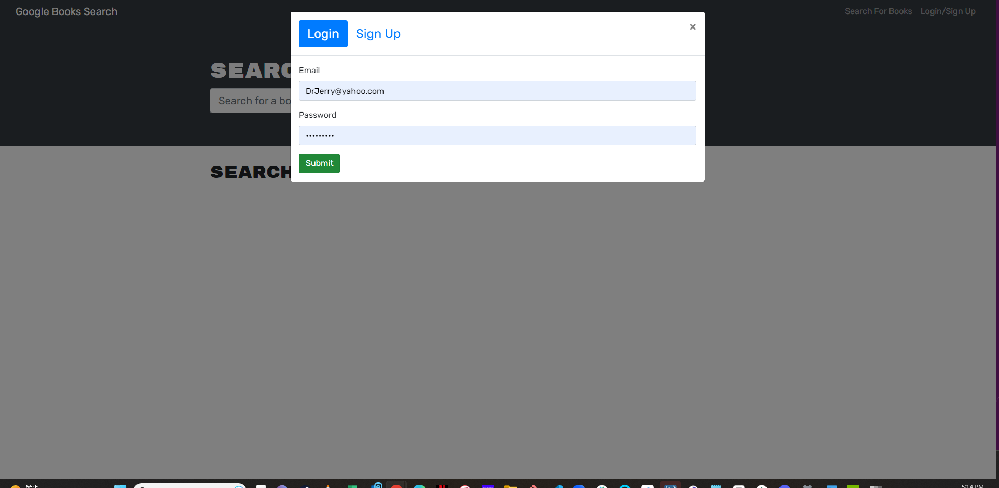
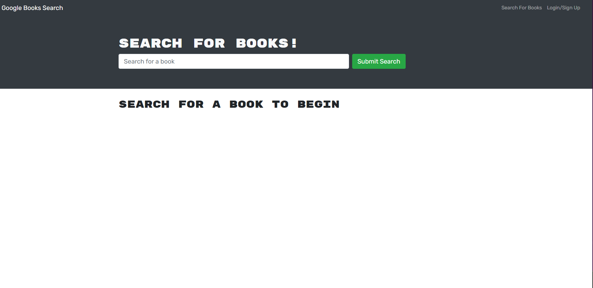
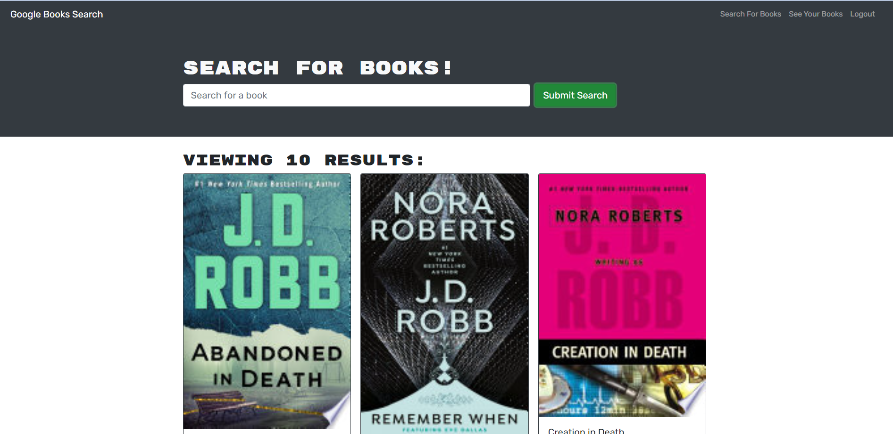
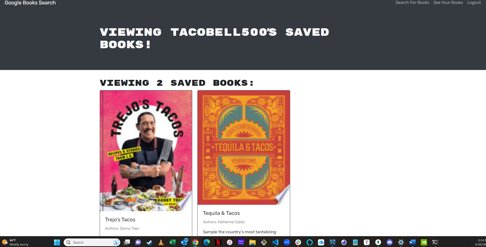

# MERN Favorite Book Library

## Table of Contents  
[Description](#description)

[Deployment](#deployment)
  
[Installation](#installation)
  
[Usage](#usage)
  
[Questions](#questions)
  
[Tests](#tests)

[Screenshots](#screenshots)
    

  ## License 
     For more info, please follow the link below.
  [LINK](https://opensource.org/license/MIT)

  ## Description

  The purpose of the application is to give the user a place to easily store their favorite books.

  The app was originallu built using the MERN stack with a React front end, MongoDB database, and Node.js/Express.js server and API.  We have refracctored it to use an Apollo Server utilizing GraphQl queries and mutations to modify data; modified the existing authentication middleware so that it works in the context of a GraphQL API; and created an Apollo Provider so that requests can communicate with an Apollo Server.

  ## Deployment

  [Mern Book Search](https://da-mern-book-search.herokuapp.com/)

  ## Installation

  npmi into each of the root, server, and client directories.  npm run develop.

  ## Usage

  npm start

  ## Tests

  npm test

  ## Screenshots
  
  
  
  

  ## Questions

  Thank you for using my application.  Please submit questions to dallen7@socal.rr.com.  Also, visit me on Github at 
    [dirtydenny](https://github.com/dirtydenny/) to see my other applications.
